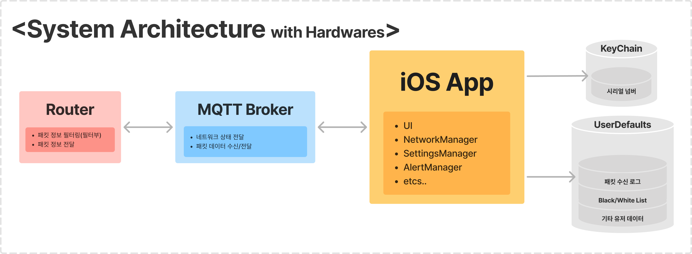

# NetHawk


## Summary
`NetHawk`는 ['24 한밭대학교 컴퓨터공학과 캡스톤디자인](https://github.com/HBNU-SWUNIV/come-capstone24-mobitoa)의  
`엣지 컴퓨팅 기반의 AI 보안 라우터`라는 주제에서 `사용자 인터페이스` 부분을 담당하는 어플입니다.  
주요 개발 개요는 [전체 프로젝트 링크](https://github.com/HBNU-SWUNIV/come-capstone24-mobitoa)를 통해 확인할 수 있습니다.

## App Introduction
`NetHawk`는 다양한 네트워크 공격에 대응하고, 보안 네트워크 환경을 제공하는 `AI 기반 보안 라우터 관리 앱`입니다.  
이 앱은 사용자 라우터와의 연결 및 연결 상태를 모니터링하고, 네트워크 위협으로부터 알림을 받을 수 있도록 설계되었습니다.

## Requirements
- **iOS Deployment Target**: `17.5`
- **Swift Version**: `5.0`
- `패킷 탐지기가 부착된 라우터`
- `OpenWRT 기반 라우터`  
  
## Screenshots
🛠️

## Features

### 라우터 연동
- `Broker Server 주소`와 사용자 소유의 `라우터 MAC 주소`를 입력하여 라우터와 기기를 연동합니다. 
- 기 연결된 유저는 자동 로그인 체크 시 메인 페이지로 이동합니다.
  
### 실시간 경고 알림
- MQTT 서버로부터 실시간 비정상 패킷 수신 경고 및 차단 알림을 수신합니다.
  
### KeyChain 저장
- MAC 주소 및 네트워크 설정을 KeyChain에 저장하고, 비정상 패킷 로그를 UserDefaults에 저장합니다.

### 비정상 패킷 통계
- 다양한 공격 유형별 통계를 제공합니다.
- 일자별 공격 통계를 제공합니다.

### IP/Port 블랙리스트 & 화이트리스트
- 특정 IP/Port에 대해 차단 혹은 오픈할 수 있는 기능을 제공합니다.
  

## Architecture



## Installation
**1. Clone Projects**
```
git clone https://github.com/yourusername/NetHawk.git
```
**2. Open and Build/Run**
~~~ 
open NetHawk.xcodeproj 
~~~


## Code Style Guide
- [Swift Style Guide](https://github.com/StyleShare/swift-style-guide)

## Fonts
- [Intel One Mono](https://github.com/intel/intel-one-mono)


## Contact
✉️ [accc45@outlook.com](mailto:accc45@outlook.com)