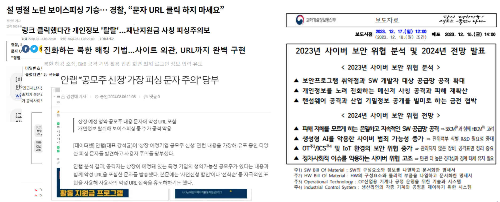
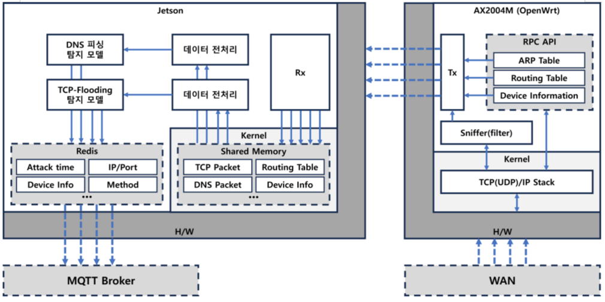
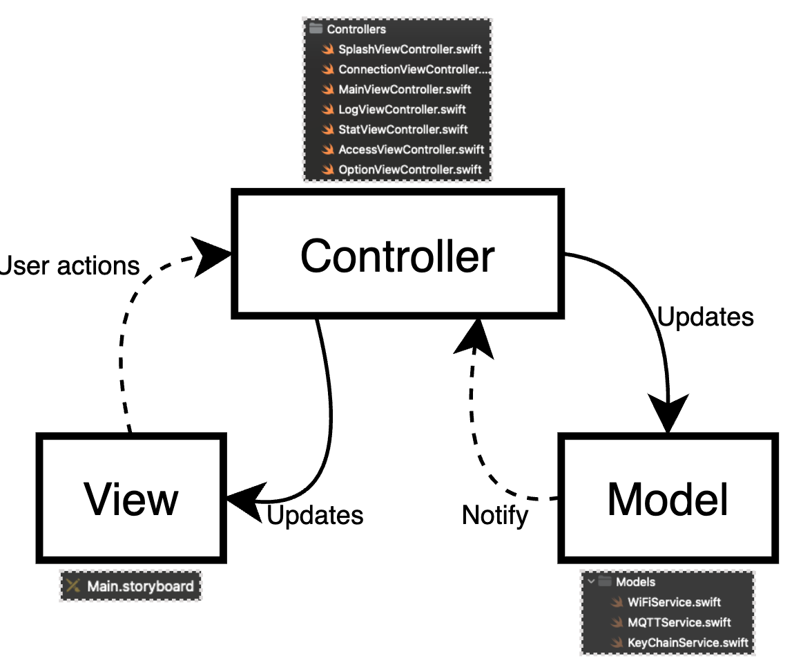

# 한밭대학교 컴퓨터공학과 MOBITOA팀

**팀 구성**
- 20191728 김정훈
- 20191773 민준혁
- 20191726 길지훈

## <u>Subject</u>
**AI secure router of edge computing**  
(엣지컴퓨팅 기반의 AI 보안 라우터)

## <u>Teamate</u> Project Background
- ### 주제에 대한 배경
  


```swift
 과학기술정보통신부와 KISA의 '2023년 사이버 보안위협 분석 및 2024년 전망 발표'에 따르면, 국내 기업과 기관을 대상으로, 계정정보를 무작위로 대입하여 로그인을 시도하는 방식인 Credential Stuffing 공격의 성공률이 로그인시도 대비 약 0.3%에 이르렀다.
```

```swift
 동 자료에 따르면, 서비스를 사칭하여 개인정보를 노리는 피싱(Phishing) 공격의 건수도 매우 늘어났다. 23년 피싱사이트 탐지 및 차단 건수는 전년 7,534건 대비 1.8배 증가한 4,206건으로 나타났다.
```

```swift
 분산 서비스 거부 (DDoS) 공격 규모 또한 급증하였다. ‘지코어 레이더 리포트’에 따르면, 2023년 상반기 800Gbps 대비 하반기의 DDoS 공격 규모는 2배 늘어난 1600Gbps로 증가했다. 공격 수법은 62%를 차지한 UDP Flooding 공격이 가장 많았으며, 표적 산업은 게임 업계가 46%로 가장 높은 비율을 차지했다.
```

- ### 필요성
```swift
 대한민국은 인터넷 공유기의 보급이 잘 이루어진 국가 중 하나이다. IPv4 주소의 고갈로 인해 각국에서는 IPv6 주소로의 이전을 시도하고 있는데, 2024년 기준 한국은 보급률 20%로 34위를 차지하고 있으며, 1위인 인도의 보급률인 63.6% 대비 1/3가량의 수치이다.
```

```swift
 공유기의 보안은 네트워크 구성 시 중요한 요소 중 하나이다. 중간자 공격(MITM: Man In The Middle)은 공격자가 사용자의 중간에 끼어들어 정보를 탈취/변조하는 공격인데, 공유기가 해당 공격의 매개체가 될 수 있기 때문이다.
```

- ### 기존 해결책의 문제점
  날이 갈수록 늘어나는 다양한 유형의 사이버 공격에 대한 대응이 미비하기에 기존 대응 알고리즘 대신, 기계학습 위주의 현대적인 대응책이나 대안이 필요하다.

## System Design
  - ### System Architectures
 

  - ### System Requirements
    ***Update soon***
    
## Case Study
  - ### Description
  
  
## Conclusion
  - ***Update soon***
  
## Project Outcome
- ***Update soon***
