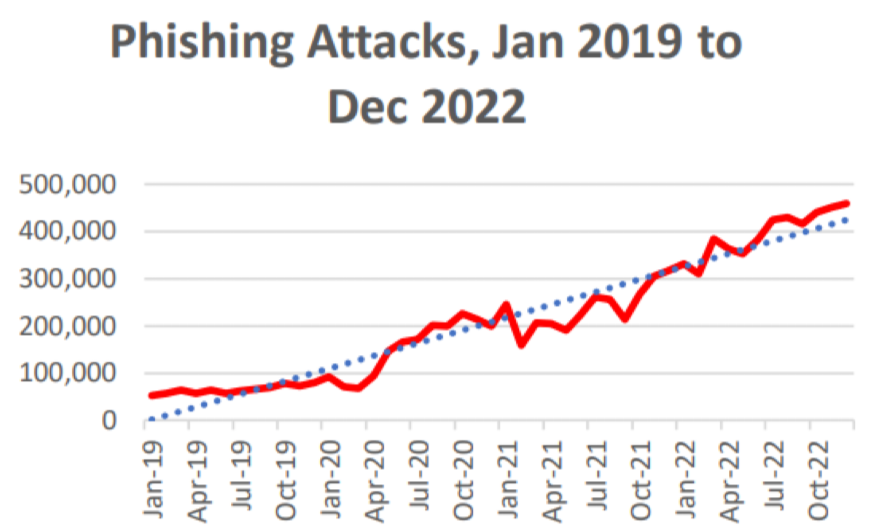
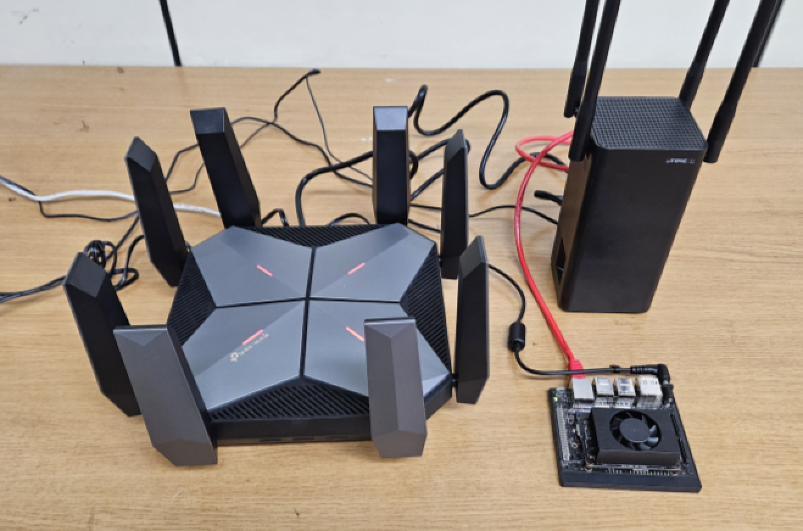
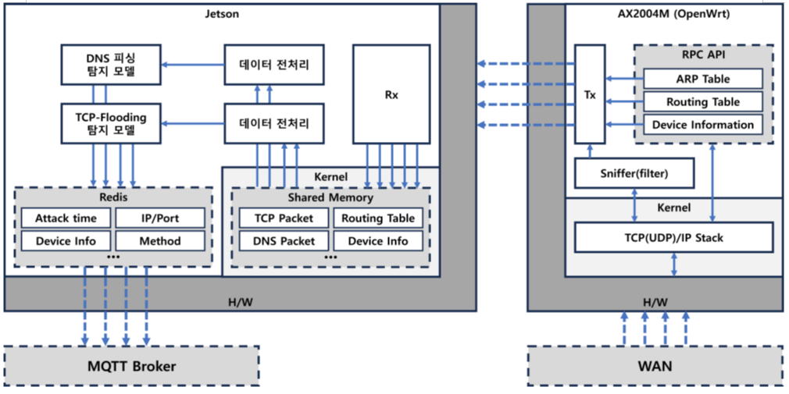
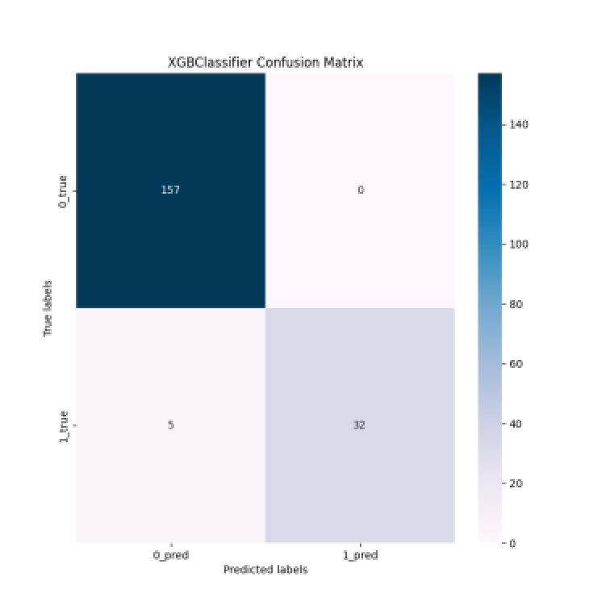
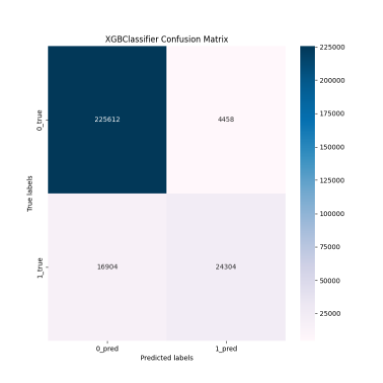

# 한밭대학교 컴퓨터공학과 MOBITOA팀

 

## 🧑🏻‍💻 **Team Configuration**

| 20191728 김정훈                                                                                      | 20191726 길지훈                                                       | 20191773 민준혁                                                                                    |
| ------------------------------------------------------------------------------------------- | ------------------------------------------------------------ | ----------------------------------------------------------------------------------------- |
|  |  |  |
| [@wjdgnsdl213](https://github.com/wjdgnsdl213)                                                    | [@giljihun](https://github.com/giljihun)                     | [@Naverdotcom](https://github.com/Naverdotcom)                                                    |

## 📚 Table of Contents

### [>> NetHawk for iOS App Repo <<](https://github.com/MOBITOA/NetHawk)

### [1. Subject](#-subject) &nbsp; &nbsp; &nbsp; &nbsp; [2. Project Background](#-project-background) &nbsp; &nbsp; &nbsp; &nbsp; [3. System Design](#-system-design) 
###  [4. Case Study](#-case-study) &nbsp; &nbsp; &nbsp; &nbsp; [5. Conclusion](#-conclusion) &nbsp; &nbsp; &nbsp; &nbsp;
### [6. Project Outcome](#-project-outcome)  

## 🤔 Subject

### **AI secure router of edge computing**  
### (엣지컴퓨팅 기반의 AI 보안 라우터)

---

  
### 📋 작품 개요
#### 1. `다양한 네트워크 공격을 탐지`하고 `대응하는 보안 네트워크 환경`을 제공
#### 2. 기존의 대응 알고리즘과 달리, `AI를 적용한 탐지법`을 통해 더욱 정교한 보안 솔루션을 제공
#### 3. `엣지 컴퓨팅`을 활용해 지연 없이 `실시간으로 패킷의 공격 여부 탐지`

### 🎯 최종 목표
#### 1. 네트워크 보안 기능 제공과 동시에 성능 최적화.
#### 2. `사용자 친화적인 인터페이스 구축`으로 `보안 관리`와 `모니터링 기능` 제공.
#### 3. 공유기 및 필터 기기에서 직접 네트워크 공격 탐지 및 대응을 실행.

## 📌 Project Background
- ### 주제에 대한 배경
  
   

   

- ### 필요성
  대한민국은 `인터넷 공유기의 보급이 잘 이루어진 국가` 중 하나이다.
IPv4 주소의 고갈로 인해 각국에서는 IPv6 주소로의 이전을 
시도하고 있는데, `2024년 기준 한국은 보급률 20%`로 34위를
차지하고 있으며, 1위인 인도의 보급률인 63.6% 대비 
1/3가량의 수치이다.

  공유기의 보안은 네트워크 구성 시 중요한 요소 중 하나이다.
`중간자 공격(MITM: Man In The Middle)`은 공격자가 
사용자의 중간에 끼어들어 정보를 탈취/변조하는 공격인데, 
`공유기가 해당 공격의 매개체가 될 수 있기 때문`이다.

  그래프는 `2019년부터 2022년까지 발생한 피싱 공격의 증가 추이`를 보여준다. 사이버 범죄는 점차 정교해지고 반복적으로 발생하고 있다. 이러한 상황 속에서 네트워크 보안 강화를 위한 필요성이 더욱 강조되고 있다. 

- ### 기존 해결책의 문제점
  날이 갈수록 늘어나는 다양한 유형의 사이버 공격에 대한
대응이 미비하기에 `기존 대응 알고리즘과 더불어, 보다 인공지능을 활용한 기계학습 위주의 현대적인 대응책이나 대안이 필요`하다.

## 🏛️ System Design
 

<b>전체 시스템 아키텍쳐</b>
  
 

  `패킷 필터 시스템`은 `OpenWrt 라우터`와 연동하여 라우터에서 스니핑된 패킷을 소켓 통신을 통해 전달받은 후, `전처리 진행 및 분류 모델을 통해 공격성을 판단`한다. 분류  결과에 따라 피해 유형과 기기, 일시 등을 추가하여 `MQTT Broker로 해당 메시지를 전송`한다.  

 

  

<b>패킷 분석 시스템 설치 환경</b>
 
 

  

<b>라우터 - 필터 시스템 상세 아키텍쳐</b>
 
 

  - ### System Requirements and Skills
    ***Update soon***
    
## 📚 Case Study
  - ### TCP/UDP-Flooding
  TCP/UDP-Flooding 탐지 모델은 0.5초간 수집된 모든 외부 TCP/UDP 패킷에서,  
   `IP주소의 가짓수, 패킷 크기, 패킷 개수, 반복 전송 IP주소의 최대 횟수`를 산출하여 분류 모델의 입력으로 사용한다.  
   분류 알고리즘은 두 탐지 모델 모두 `XGBoost`를 사용하였다.   
   `학습:검증 = 4:1 비율로 데이터를 분할`하였고, 각 모델의 검증 결과는 아래와 같다.  

| Model                      | Precision | Recall | F1-score | Accuracy |
| -------------------------- | --------- | ------ | -------- | -------- |
| **TCP-Flooding 탐지 모델** | 0.80      | 0.72   | 0.75     | 0.87     |
| **UDP-Flooding 탐지 모델** | 0.98      | 0.93   | 0.96     | 0.97     |

<b>TCP/UDP-Flooding 탐지 모델의 검증 평가지표</b>
 
 

    
    
<b>TCP-Flooding 탐지 모델의 Confusion Matrix</b>

    
    
<b>UDP-Flooding 탐지 모델의 Confusion Matrix</b>

- ### Domain Phishing
  Domain-Phishing 탐지 모델은 DNS Respone 패킷에서,  
   `대시(“-”)포함 여부`, `도메인 문자 길이`, `서브도메인 수`, `특수문자 수`, `전체 도메인에서 자음/모음/숫자가 차지하는 비율`, `자음-모음 간 비율`, `tld의 자음 비율`, `연속된 자음/숫자의 길이 등 13가지 특징`을 산출한다.   
   `1,356,387개의 데이터`를 `학습:검증 = 4:1 비율로 분할`하였고, 분류 알고리즘은 Random Forest, LightGBM, Decision Tree, XGBoost를 비교한 결과 `XGBoost`가 평가지표상 가장 높은 수치를 기록하였으며 검증 결과는 아래와 같다.
   

| Model                       | Precision | Recall | F1-score | Accuracy |
| ----------------------------- | --------- | ------ | -------- | -------- |
| **Domain-Phishing 탐지 모델** | 0.89      | 0.79   | 0.82     | 0.92     |

<b>Domain-Phishing 탐지 모델의 검증 평가지표  </b>
 
 

 

<b>Domain-Phishing  탐지 모델의 Confusion matrix</b>
 

  
## 🏁 Conclusion

  사용자 인터페이스 부는 `UIKit 프레임워크 기반의 iOS 앱`을 통해 제공되며, `CocoaMQTT 라이브러리를 사용하여 MQTT Broker와 데이터 송수신`을 통해 비정상 패킷 탐지에 대한 알림을 받을 수 있다. 또한, 특정 IP에 대한 화이트리스트, 블랙리스트 기능이나 공격에 대한 통계 등 사용자 맞춤형 보안 관리를 제공한다.  
  ### [>> 'NetHawk' 앱 레포지토리 링크](https://github.com/MOBITOA/NetHawk)
## ★ Project Outcome
- ***Update soon***
